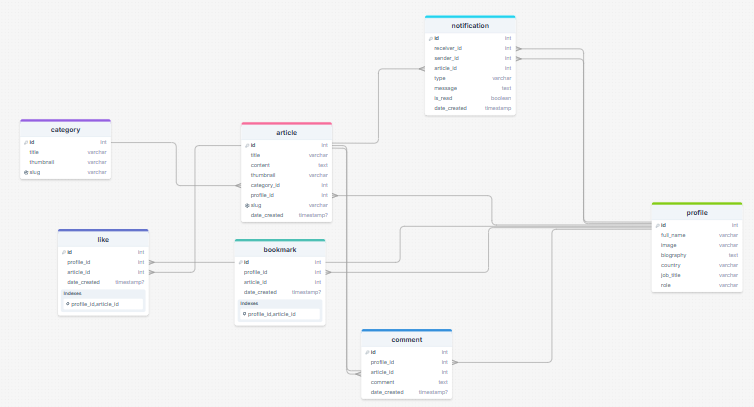

# Blog Web Project

## Introduction
This is a blog web project built with Next.js, a modern React framework that enables building high-performance and SEO-friendly web applications. The project provides a full-featured blog platform with a user-friendly interface.

## Key Features
- 🚀 Built with Next.js
- 💅 Modern UI with Tailwind CSS and ShadcnUI
- 📝 Blog content management system
- 🗄️ Supabase integration for database and authentication

## System Requirements
- Node.js 18.17.0 or higher
- npm or yarn
- Git
- Supabase account (free tier available)

## Database
The project uses Supabase as its backend service, providing:
- PostgreSQL database
- Real-time subscriptions
- Authentication and authorization
- Storage for media files
- Database backups



### Database Setup
1. Create a new project in Supabase
2. Go to SQL Editor in your Supabase dashboard
3. Import the database schema:
   - Open the SQL file `data-postgresql-file.sql` in my project
   - Copy the entire content
   - Paste it into the SQL Editor in Supabase
   - Click "Run" to execute the SQL commands

This will create all necessary tables and relationships for the blog system.

## Installation

1. Clone repository:
```bash
git clone [repository-url]
cd Blog-Web-Project
```

2. Navigate to project directory:
```bash
cd mk-blog
```

3. Install dependencies:
```bash
npm install
# or
yarn install
```

4. Create environment file:
```bash
cp .env.example .env.local
```

5. Set up Supabase:
   - Create a new project at [Supabase](https://supabase.com)
   - Get your project URL and anon key from the project settings
   - Update the following variables in `.env.local`:
     ```
     NEXT_PUBLIC_SUPABASE_URL=your-project-url
     NEXT_PUBLIC_SUPABASE_ANON_KEY=your-anon-key
     ```

6. Update other environment variables in `.env.local` with your information.

## Running the Project

### Development Environment
```bash
npm run dev
# or
yarn dev
```
Visit http://localhost:3000 to view the application.

### Production Build
```bash
npm run build
# or
yarn build
```

### Run Production Version
```bash
npm run start
# or
yarn start
```

## Directory Structure
```
mk-blog/
├── src/
│   ├── app/                    # App router and pages
│   │   ├── api/               # API routes
│   │   │   ├── auth/         # Authentication API
│   │   │   └── posts/        # Posts API
│   │   ├── (auth)/           # Authentication routes
│   │   │   ├── login/        # Login page
│   │   │   └── register/     # Registration page
│   │   ├── blog/             # Blog routes
│   │   │   ├── [slug]/       # Post detail page
│   │   │   └── page.js       # Posts list page
│   │   ├── dashboard/        # Admin dashboard
│   │   │   ├── posts/        # Posts management
│   │   │   └── settings/     # Settings
│   │   └── page.js           # Home page
│   ├── components/            # React components
│   │   ├── ui/               # Basic UI components
│   │   │   ├── Button.js
│   │   │   ├── Input.js
│   │   │   └── Card.js
│   │   ├── blog/             # Blog-related components
│   │   │   ├── PostCard.js
│   │   │   └── PostList.js
│   │   └── layout/           # Layout components
│   │       ├── Header.js
│   │       ├── Footer.js
│   │       └── Sidebar.js
│   ├── lib/                   # Utility functions and helpers
│   │   ├── cache.js          # Caching system
│   │   ├── auth.js           # Authentication
│   │   └── utils.js          # Utility functions
│   └── styles/               # Global styles
│       └── globals.css       # Global CSS
├── public/                    # Static files
│   ├── images/               # Images
│   └── fonts/                # Fonts
├── .env.example              # Environment variables template
├── .gitignore               # Git ignore rules
├── next.config.mjs          # Next.js configuration
├── package.json             # Dependencies and scripts
├── postcss.config.mjs       # PostCSS configuration
└── tailwind.config.js       # Tailwind CSS configuration
```

## Usage Guide

### Managing Posts
1. Log in to the system
2. Access the Dashboard
3. Create new posts or edit existing ones

### Customizing the Interface
- Styles are defined in the `src/styles` directory
- Components can be customized in the `src/components` directory

## Demo Video


## Contact
If you have any questions or suggestions, please create an issue in the repository or contact via email khoinguyenminhk37@gmail.comcom
